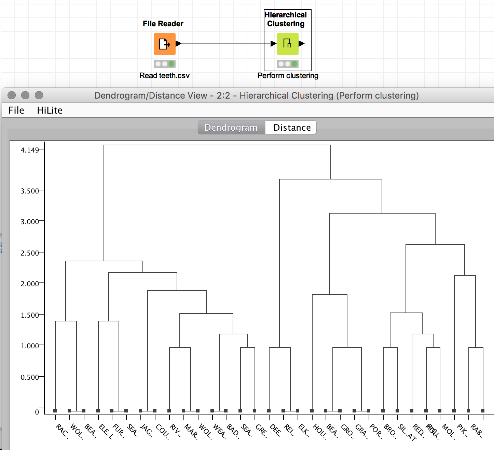
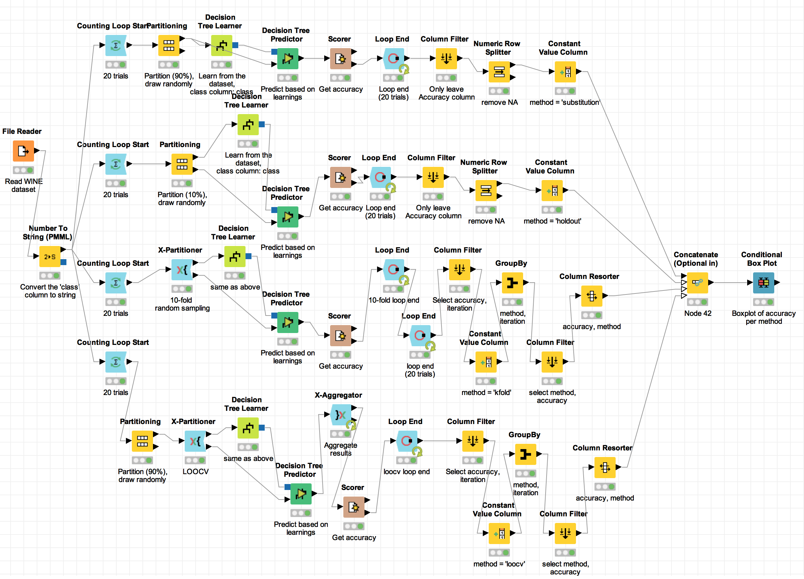
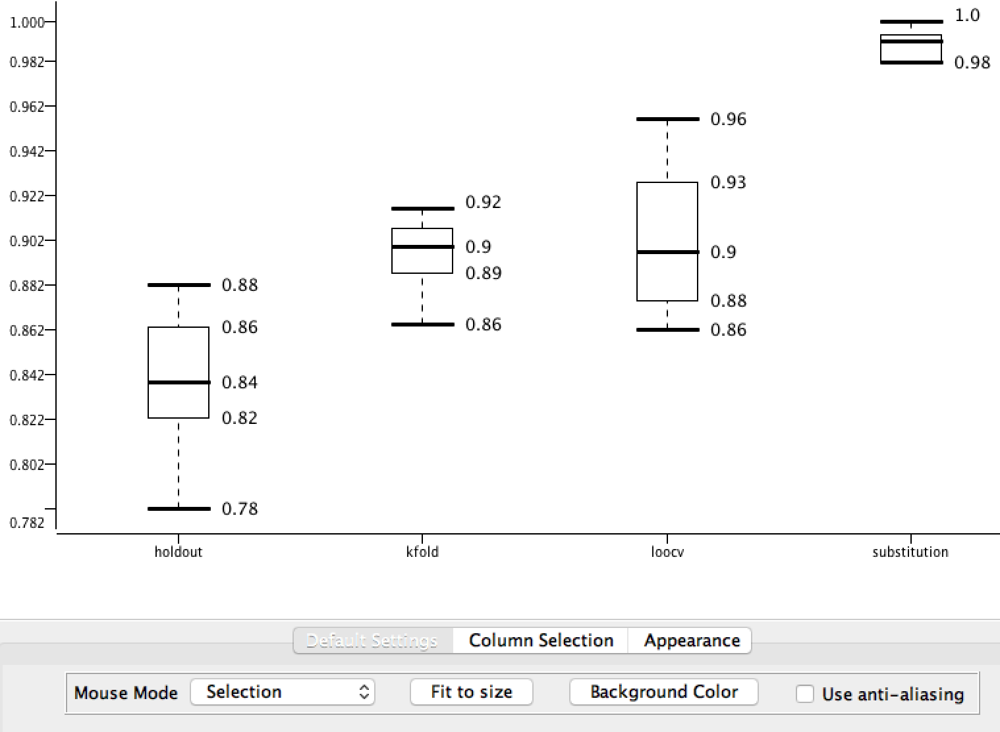
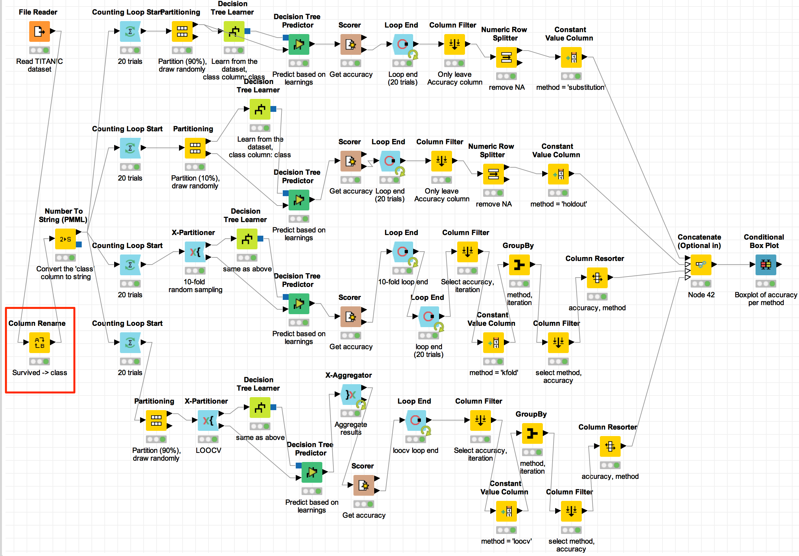
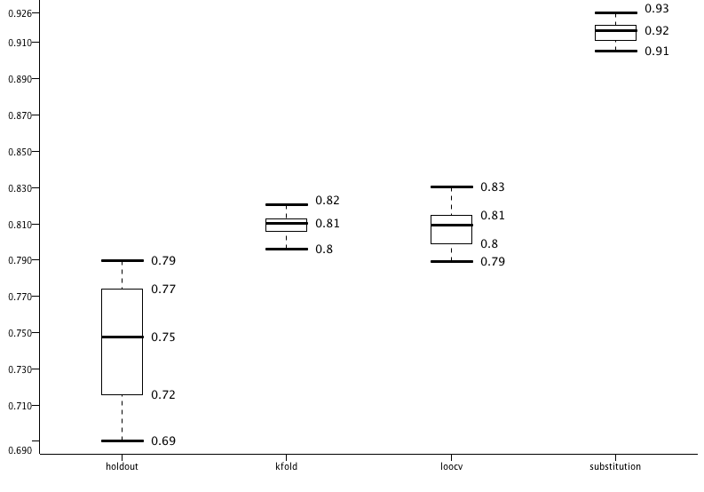

```{r setup, include=FALSE}
knitr::opts_chunk$set(echo = TRUE)
```

# Problem #1 - Hierarchical Clustering

You are required to extract and provide some statistics about the dataset "teeth.csv"
They should include the number of records, the number of attributes, the range and mean value of each attribute,
and the histogram of for each attribute.
You are required to apply hierarchical clustering to all the records in the dataset and to
visualise the resulting dendrogram. The dendrogram should report the class labels of the data records at the leaf nodes.
The generation of the dendrogram should be performed twice: with KNIME and with R.
The corresponding KNIME workflow and the R code should be reported and discussed.
In your coursework report, you should include:

* the statistics and discussion on them
* and image of the KNIME workflow and a presentation of relevant code configurations
* the dendrogram generated with KNIME
* the R code
* the dendrogram generated with R code

## Solution in R
We will be showcasing some code while doing the computations.

```{r problem1, message=FALSE, warning=FALSE}
library(dplyr) # general data cleaning and manipulation
library(ggplot2) # nicer plots
library(rpart) # needed for rpart()
library(readr) # needed for read_csv()
library(tidyr) # needed for spread() and gather()
library(knitr) # knitr functions
```

Let's read the data from *teeth.csv*.
```{r warning=FALSE}
# read the data file
data_filename <- "data/teeth.csv"
df <- read_csv(data_filename)
```

This is how the data frame looks like:
```{r}
head(df)
```

There are 31 rows and 8 columns in the dataset. Let's retrieve required statistics for each variable - min, mean, max values and standard deviation.
```{r}
df.s <- select(df, -Animal) %>%
        gather() %>% 
        group_by(key) %>% 
        summarise(
                "mean" = mean(value),
                "min" = min(value),
                "max" = max(value),
                "lower" = mean(value) - sd(value),
                "upper" = mean(value) + sd(value),
                "sd" = sd(value)
        )
kable(df.s)
```

Now let's plot the above.
```{r}
ggplot(df.s, aes(key)) +
        geom_boxplot(
                aes(lower = lower, ymin = min, middle = mean, ymax = max, upper = upper),
                stat = 'identity') +
        ggtitle(paste0("Animals' teeth (n=", nrow(df), ", m=", ncol(df)-1, ")")) +
        xlab("Attribute") +
        ylab("Value")
```

And here is a histogram of each and every attribute of the dataset.

```{r}
hists <- gather(select(df, -Animal))
hists$key <- as.factor(hists$key)
ggplot(data = hists, aes(x = value)) +
        geom_bar() +
        facet_grid(. ~ key)
```

Proceeding with hierarchical clustering.
```{r, warning=FALSE}
# assign row names to be the value of Animal column,
# this is later used in the dendrogram as labels
rownames(df) <- df$Animal

# hierarchical clustering
# the average method was chosen for best results
hc <- hclust(dist(select(df, -Animal)), method = "average")

# cut the tree and group animals
cluster_membership <- cutree(hc, 12)

# colour the dendrogram
label_colours <- c(
  'red', 'orange', 'grey', 'lightgreen', 'green',
  'darkgreen', 'cyan', 'black', 'blue', 'violet')
colour_label <- function(n) {
  if (is.leaf(n)) {
    a <- attributes(n)
    lc <- label_colours[cluster_membership[which(names(cluster_membership) == a$label)]]
    attr(n, "nodePar") <- c(a$nodePar, lab.col = lc)
  }
  return(n)
}
# apply the colouring function
cluster_dendrogram <- dendrapply(as.dendrogram(hc), colour_label)

# show the dendrogram with coloured groups of animals
plot(cluster_dendrogram)
```

# Solution in KNIME

The solution in KNIME only requires hierarchical clustering and no exploratory analysis so the workflow is very simple.
We first load the CSV file using a $FileReader$ node where we provide the filename and set the "read row IDs" option. This makes the $FileReader$ node set row names according to the first column of the dataset which in our case is $Animal$. Once the datafile has been read and columns have been set, we perform hierarchical clustering using the $Hierarchical Clustering$ node. We use the $Euclidian$ distance function and set linkage type to $AVERAGE$ to get similar results to the clustering performed in $R$ previously.

The image below shows the KNIME flow and the output of the hierarchical clustering.


This flow is exported as *csmdm_assignment_problem1.knar.knwf*.

## Problem #2 - Classification

You are required to build and test a classification model for two datasets:

- https://archive.ics.uci.edu/ml/machine-learning-databases/wine/wine.data
- a dataset of your choice (excluding iris, wine, teeth)

A description of the wine dataset (including column headers) is provided in the
corresponding file with extension ".names".

You can use any classification algorithm. You are required to carry out a comparison of the
following four model evaluation methods for each of the two datasets using the same
classification algorithm.

1. *resub*: resubstitution error method
2. *hold-out-10%*: hold-out method with 10% - 90% partition split
3. *xVal-10f*: 10-fold cross-validation method
4. *LOOCV*: leave-one-out cross-validation method

For each method you need to compute the average and standard deviation of the accuracy
over 20 trials.
The results, the KNIME workflows (with relevant node configurations) and the R code must
be included and commented in the coursework report.

# Solution in R - WINE
We will first perform our analysis on the wine dataset. Here we load it and provide a quick summary.
```{r}
wdf <- read_csv("https://archive.ics.uci.edu/ml/machine-learning-databases/wine/wine.data")
wdf_names <- c('class', 'alcohol', 'malic.acid', 'ash',
               'alcalinity.of.ash', 'magnesium', 'total.phenols', 'flavanoids',
               'nonflavanoid.phenols', 'proanthocyanins', 'color.intensity',
               'hue', 'od280od315.of.dliuted.wines', 'proline')
names(wdf) <- wdf_names
wdf$class <- as.factor(wdf$class)
str(wdf)
```

Below are definitions of the functions that we use for sampling.
All four sampling algorithms return a list of the form list("test" = test_data_frame, "train" = train_data_frame).
```{r}
# implementation of the holdout method
myholdout <- function(x, pct, shuffle=TRUE) {
        if (shuffle)
                x <- x[sample(nrow(x), nrow(x)), ]
        test_index <- 1:floor(nrow(x) * pct)
        test <- x[test_index, ]
        train <- x[-test_index, ]
        result <- list("test" = test, "train" = train)
        return(result)
}
# resubstitution method uses holdout but returns
# a test set that is part of the training set
myresub <- function(x, pct) {
        holdout <- myholdout(x, pct, shuffle=FALSE)
        train <- holdout$train
        train <- train[sample(nrow(train), nrow(train)), ] # shuffle training set
        test <- train[1:nrow(holdout$test), ] # test set is part of training set
        result <- list("test" = test, "train" = train)
        return(result)
}

# we run this with k=1..10
my10fold <- function(x, k, shuffle=TRUE) {
        if (shuffle)
                x <- x[sample(nrow(x), nrow(x)), ]
        test_rows <- floor(nrow(x) * 0.10)
        end_idx <- k * test_rows
        start_idx <- end_idx - test_rows + 1
        test_idx <- start_idx:end_idx
        test <- x[test_idx, ]
        train <- x[! 1:nrow(x) %in% test_idx, ]
        result <- list("test" = test, "train" = train)
        return(result)
}

# uses kfold with k=1..10
myloocv <- function(x, k, shuffle=TRUE) {
        result <- my10fold(x, k, shuffle)
        result$test <- result$test[1, ]
        return(result)
}
```

Since we've separated sampling from training methods, we can very easily plug in and test two classification algorithms instead of one.
The first model builds a decision tree that predicts the "class" variable based on the rest of the variables.
The second model uses the same formula but sets *control = rpart.control(minsplit=5)* which results in a better performing model.
```{r}
mypredict_wine_model1 <- function(train, test) {
        dt <- rpart(class ~ ., data=train)
        predicted <- predict(dt, select(test, -class), type = "class")
        hit <- predicted == test$class
        return(sum(hit) / nrow(test))
}
mypredict_wine_model2 <- function(train, test) {
        dt <- rpart(class ~ ., data=train, control = rpart.control(minsplit = 5))
        predicted <- predict(dt, select(test, -class), type = "class")
        hit <- predicted == test$class
        return(sum(hit) / nrow(test))
}
```

The function below receives a dataframe and splits it in training and test data set using the four different sampling algorithms. It then applies the model it's being fed on every training and test set returned by the different sampling functions. The *class* variable is predicted by the model and crosschecked with the true value. The function finally returns a data frame with mean model accuracy for every model.
```{r}
get_accuracy_stats <- function(df, f_model, model_name) {
        accuracy <- data.frame()
        resubstitution.data <- myresub(df, 0.10)
        holdout.data <- myholdout(df, 0.10)
        accuracy[1, "resubstitution"] <- f_model(resubstitution.data$train, resubstitution.data$test)
        accuracy[1, "holdout"] <- f_model(holdout.data$train, holdout.data$test)

        kfold_accuracy <- c()
        loocv_accuracy <- c()
        for (k in 1:10) {
                kfold.data <- my10fold(df, k)
                loocv.data <- myloocv(df, k)
                kfold_accuracy <- c(kfold_accuracy, f_model(kfold.data$train, kfold.data$test))
                loocv_accuracy <- c(loocv_accuracy, f_model(loocv.data$train, loocv.data$test))
        }
        accuracy[1, "kfold"] <- mean(kfold_accuracy)
        accuracy[1, "loocv"] <- mean(loocv_accuracy)
        accuracy[1, "model_name"] <- model_name
        return(accuracy)
}
```

We proceed to run the function above 20 times with our two models, wine_model1 and wine_model2.
```{r}
num_trials <- 20
accuracy <- data.frame()
for (i in 1:num_trials)  {
        accuracy <- rbind(
                get_accuracy_stats(wdf, mypredict_wine_model1, "wine_model1"),
                get_accuracy_stats(wdf, mypredict_wine_model2, "wine_model2"),
                accuracy
        )
}
```

Group the results in an easy to plot structure.
```{r}
accuracy.s <- accuracy %>% gather(key=model_name)
names(accuracy.s)[2] <- "method_name"
accuracy.s <- accuracy.s %>% 
        group_by(model_name, method_name) %>% 
        summarise(
                "mean" = mean(value),
                "min" = min(value),
                "max" = max(value),
                "lower" = mean(value) - sd(value),
                "upper" = mean(value) + sd(value),
                "sd" = sd(value)
        )
```

Plot accuracies for different sampling methods and models.
```{r}
ggplot(accuracy.s, aes(method_name)) +
        geom_boxplot(
                aes(lower = lower, ymin = min, middle = mean, ymax = max, upper = upper),
                stat = 'identity') +
        ggtitle("Model and method comparison") +
        xlab("Method") +
        ylab("Accuracy") +
        facet_grid(. ~ model_name)
```
The chart above shows average accuracies over twenty trials for each of the four sampling methods and each of the two models. There are several things worth mentioning.

1. resubstitution method prefoerms very well, as expected, since the test data is a subset of the training data.
2. the leave-one-out method gives us high average accuracy but this can vary dramatically between specific training and test sets.
3. the holdout and 10-fold cross validation methods give us similar accuracy which is more stable than the one provided by the leave-one-out method.
4. the most robust method with both models is 10-fold cross validation.

Looking at the differences between the accuracies of both models we can see that pruning the tree has improved model performance. Setting minsplit=5 results in about 2% accuracy boost of the 10-fold cross validation method from model1 to model2.

This concludes our wine case study. We will now move on to the Titanic dataset.

# Solution in R - TITANIC
The titanic dataset allows us to predict whether a Titanic passenger would survive or not depending on their features like age, sex, passenger class, etc. Here we read the data and print the first few records.
```{r}
tdf <- read_csv("data/titanic.csv")
tdf$PassengerId <- NULL
tdf$Survived <- as.factor(tdf$Survived)
head(tdf)
```

We will predict $Survived$ using two different models defined below.
```{r}
mypredict_titanic_model1 <- function(train, test) {
        dt <- rpart(Survived ~ Sex, data=train)
        predicted <- predict(dt, select(test, -Survived), type = "class")
        hit <- predicted == test$Survived
        return(sum(hit) / nrow(test))
}
mypredict_titanic_model2 <- function(train, test) {
        dt <- rpart(
                Survived ~ Pclass + Sex + Age + SibSp + Parch + Fare + Embarked,
                data=train, control = rpart.control(minsplit = 5)
                )
        predicted <- predict(dt, select(test, -Survived), type = "class")
        hit <- predicted == test$Survived
        return(sum(hit) / nrow(test))
}
```

For sampling we will use the functions we defined while exploring the wine dataset. We will again test 20 trials of four sampling methods and two different models.
```{r}
num_trials <- 20
accuracy <- data.frame()
for (i in 1:num_trials)  {
        accuracy <- rbind(
                get_accuracy_stats(tdf, mypredict_titanic_model1, "titanic_model1"),
                get_accuracy_stats(tdf, mypredict_titanic_model2, "titanic_model2"),
                accuracy
        )
}
```

Gather the results in an easy to plot format...
```{r}
accuracy.s <- accuracy %>% gather(key=model_name)
names(accuracy.s)[2] <- "method_name"
accuracy.s <- accuracy.s %>% 
        group_by(model_name, method_name) %>% 
        summarise(
                "mean" = mean(value),
                "min" = min(value),
                "max" = max(value),
                "lower" = mean(value) - sd(value),
                "upper" = mean(value) + sd(value),
                "sd" = sd(value)
        )
```

Plot accuracy statistics.
```{r}
ggplot(accuracy.s, aes(method_name)) +
        geom_boxplot(
                aes(lower = lower, ymin = min, middle = mean, ymax = max, upper = upper),
                stat = 'identity') +
        ggtitle("Model and method comparison") +
        xlab("Method") +
        ylab("Accuracy") +
        facet_grid(. ~ model_name)
```
The results we get are similar to the ones from the wine case study. 10-fold cross validation is still the most robust method. Model-wise, our first model only uses $Sex$ to predict survival whereas the second model, which is more accurate, uses more features and prunes the tree at $minsplit=5$.

This concludes our TITANIC case study.

# Solution in KNIME - WINE
We are now going to solve problem #2 in KNIME using the WINE dataset.

To make things easier, we've downloaded *wine.data* as *wine.csv* and we've set the following header row:
class, alcohol, malic.acid, ash, alcalinity.of.ash, magnesium, total.phenols, flavanoids, nonflavanoid.phenols, proanthocyanins, color.intensity, hue, od280od315.of.dliuted.wines, proline

We then go through the following KNIME workflow:



The flow loads the wine dataset, changes the *class* column from Integer to String and proceeds to run 20 iterations of four different sampling methods. The result from the sampling is passed to decision tree learners and predictors using the same parameters. Accuracy statistics for each sampling method are gathered and finally combind and plotted using a boxplot.

The resulting dataframe contains mean accuracy of each method for every one of the 20 iterations.

The boxplot of the mean accuracies is shown here:




The results are similar to what we've observed using R - the flow is exported as *csmdm_assignment_problem2wine.knar.knwf*.

Let's proceed with applying the same technique to the Titanic dataset.

# Solution in KNIME - TITANIC
We are now going to solve problem #2 in KNIME using the TITANIC dataset.

The nature of the TITANIC dataset is discussed in the R solution of Problem #2 - its label column is called $Survived$. In order to reuse as much as possible of our KNIME workflow for the WINE dataset, we will transform the TITANIC dataset to a WINE-like dataset. This involves renaming the $Survived$ column to $class$. Once we have done this, we can reuse all of the logic in the loops and the boxplot.

Our KNIME workflow for the TITANIC dataset therefore looks like this:



The flow then works exactly as it does on the WINE dataset but it uses the TITANIC dataset instead.

After they are calculated, the mean accuracies are plotted here:




The results are similar to what we've observed using previously with the WINE dataset.
The TITANIC KNIME workflow is exported as *csmdm_assignment_problem2titanic.knar.knwf*.
